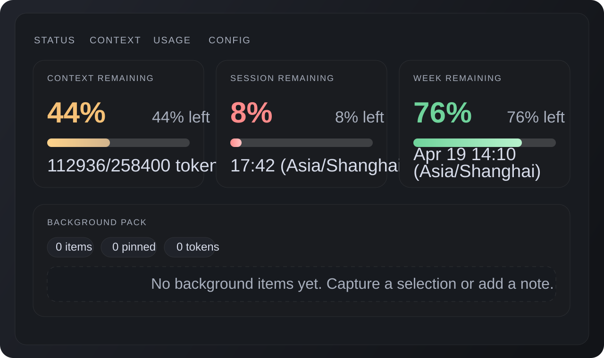
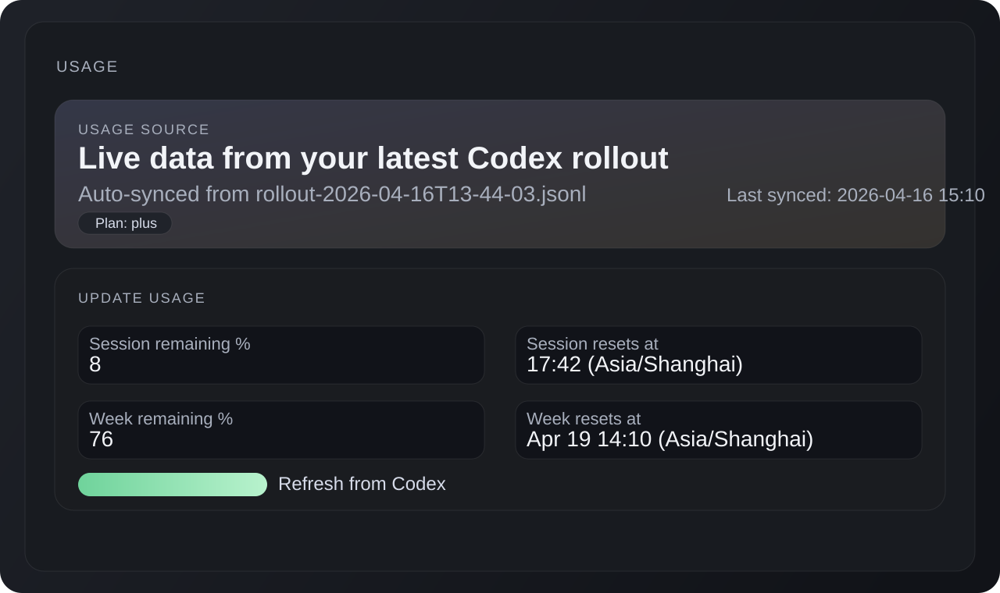
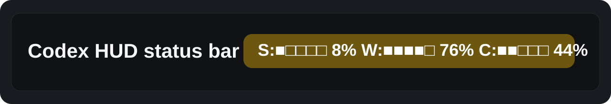

# Codex HUD

`Codex HUD` is a local VS Code companion extension that adds:

- a status bar summary for session, weekly, and context-window usage
- a bottom panel view for usage bars and quick config
- a background-context manager for storing reusable notes/snippets
- a local DuoTuan desktop pet that can wake with Codex task activity

Codex HUD is designed to make Codex quota and context usage visible without leaving VS Code. It gives you a compact HUD for session, week, and thread context state while keeping reusable background notes close at hand.

## Preview

_Top-level HUD cards for context, session, and weekly remaining quota._

_Usage source and refresh workflow inside the Codex HUD panel._

_Compact status bar summary for quick quota checks while you work._

Repository social preview asset: `assets/social-preview.png`

## What this first version does

- Shows a status bar entry like `Codex S:42% W:18% Ctx:36%`
- Opens a bottom panel named `Codex HUD`
- Lets you save manual background notes or capture editor selections
- Estimates token cost for stored notes
- Tracks a context-window budget with progress bars
- Lets you manually enter session/week usage and reset labels

## Usage auto-sync

This version can auto-read real usage from your local Codex rollout history in `~/.codex/sessions`.

It extracts:

- current short-window usage
- current weekly usage
- latest thread token usage
- model context window size

`Session` and `Week` come from your real local Codex rollout data.

`Ctx` is different on purpose: it measures the background items managed by this HUD, plus any reserved base tokens you configure. It does not mirror the full cumulative thread token total.

If rollout data is missing, the HUD falls back to manual values from `codexHud.*`.

## Run locally

1. Open the `codex-hud` folder in VS Code.
2. Run `npm run build:desktop-pet` if you want to use the local DuoTuan desktop pet.
3. Press `F5` to launch an Extension Development Host.
4. In the new window, open the panel container named `Codex`.
5. Use the status bar item or the command palette:
   `Codex HUD: Open Panel`

The bundled pet package lives at `pets/duotuan`. The desktop helper prefers installed packages under `~/.codex/pets/<slug>`, then falls back to bundled packages under `pets/<slug>`.

Pet auto wake updates local OpenAI/Codex extension assets so the pet opens with Codex. Use `Codex HUD: Disable Pet Auto Wake` to restore the patch, or `Codex HUD: Repair Pet Auto Wake` after the OpenAI extension updates.

Right-click the desktop pet and use `切换形象` to switch among available pet packages. The helper updates `codexHud.petAutoWake.petSlug` and `codexHud.petAutoWake.petId` through the extension URI handler, so the selected pet persists for the next launch.

The desktop pet also shows a lightweight rest bubble every 30 minutes when no task bubble is open. It stays for 4-6 seconds, ignores mouse events, and does not interrupt the active editor.

## Useful commands

- `Codex HUD: Open Panel`
- `Codex HUD: Refresh Usage from Codex`
- `Codex HUD: Capture Selection as Context`
- `Codex HUD: Enable Pet Auto Wake`
- `Codex HUD: Disable Pet Auto Wake`
- `Codex HUD: Repair Pet Auto Wake`
- `Codex HUD: Set Session Usage`
- `Codex HUD: Set Weekly Usage`
- `Codex HUD: Clear Stored Context`

## Next good upgrade

If you want, the next step can be one of these:

1. Add richer parsing for multiple models / multiple rate-limit buckets.
2. Add a real side panel tree for context packs and folders.
3. Add import/export for context presets by workspace.
